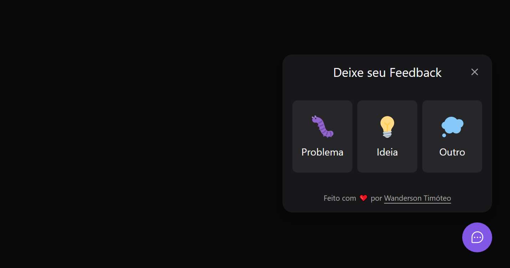
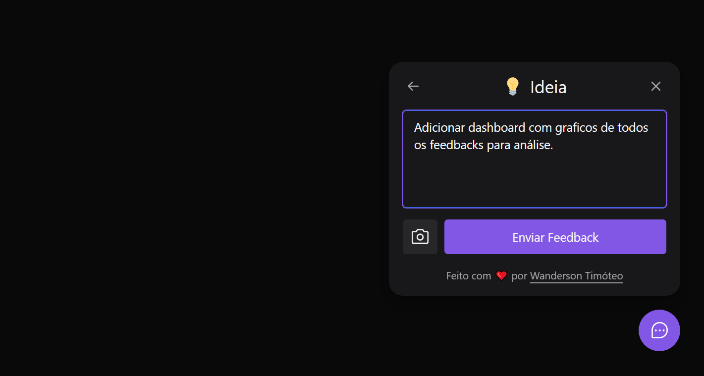
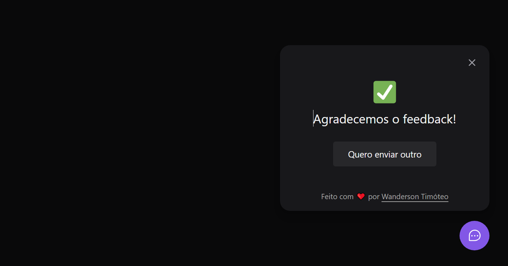
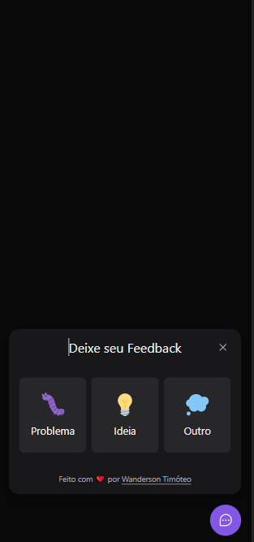
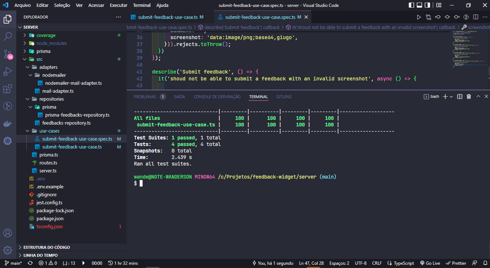
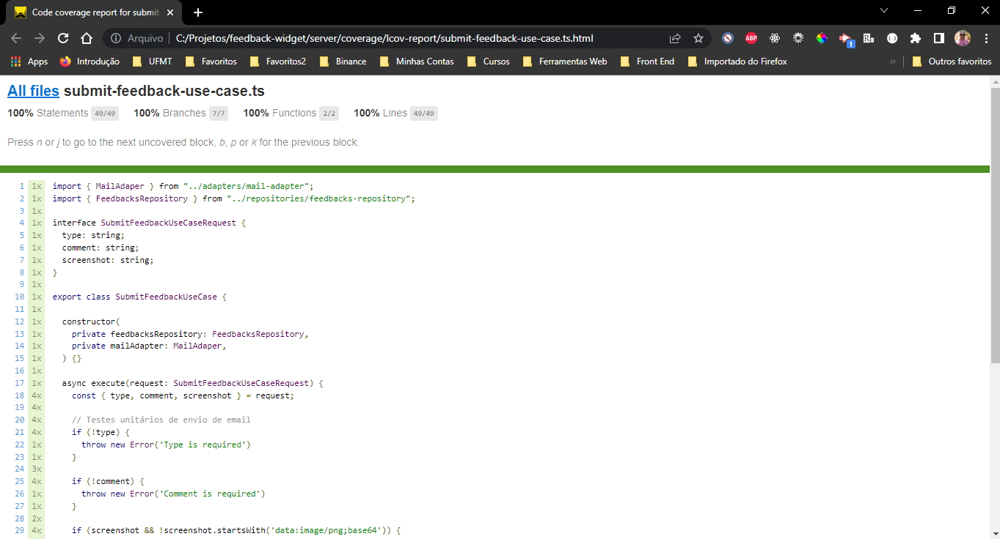
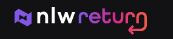

<h1 align="center">
  Feedback Widget
</h1>

<p align="center">

  <a href="#-projeto">Projeto</a>&nbsp;&nbsp;&nbsp;|&nbsp;&nbsp;&nbsp;
  <a href="#-tecnologias">Tecnologias</a>&nbsp;&nbsp;&nbsp;|&nbsp;&nbsp;&nbsp;
  <a href="#-layout">Layout</a>&nbsp;&nbsp;&nbsp;|&nbsp;&nbsp;&nbsp;
  <a href="#memo-licença">Licença</a>
</p>

<p align="center">
  
  
  
</p>

<br>

## 💻 Projeto

O sistema consiste em um widget para enviar feedbacks que poderá ser implementado em uma aplicação, sua navegação foi preparada para acessibilidade. Este foi desenvolvido seguindo as boas práticas de programação com testes unitários e aplicando os princípios SOLID. Poderá ser testado visitando o link abaixo.

---
<br>

## ✨ Visitar o site Feedback Widget

### [Clique aqui](https://https://feedback-widget-wanderson-timoteo.vercel.app/)

<br>

### Desktop Tela Inicial

<p align="center">
    
</p>

<br>

### Desktop Tela de Feedback

<p align="center">
    
</p>

<br>

### Desktop Tela de Agradecimento

<p align="center">
    
</p>

### Desktop - Responsividade

<p align="center">
    
</p>

---
<br>

## 🚀 Tecnologias

Esse projeto foi desenvolvido com as seguintes tecnologias e ferramentas:

- [Vite](https://vitejs.dev/guide/)
- [React](https://pt-br.reactjs.org/)
- [Typescript](https://www.typescriptlang.org/)
- [Vercel](https://vercel.com/)
- [Railway.app](https://railway.app/)
- [TailwindCSS](https://tailwindcss.com/)
- [Phosphor Icons](https://phosphoricons.com/)
- [SQLite - Dev](https://sqlite.org/index.html)
- [PostgreSQL - Prod](https://www.postgresql.org/)
- [Axios](https://axios-http.com/)
- [Express](http://expressjs.com/pt-br/)
- [Cors](https://www.npmjs.com/package/cors)
- [Nodemailer](https://nodemailer.com/about/)
- [Jest](https://jestjs.io/pt-BR/docs/getting-started)
- [Prisma ORM](https://www.prisma.io/)
- [Mailtrap.io](https://mailtrap.io/)
- [Insomnia](https://insomnia.rest/download)

---
<br>

## 🔖 Layout

Você pode visualizar o layout do projeto através [desse link](https://www.figma.com/file/OYWAjxo4NeQLMXnZ6GQYvU/Feedback-Widget-(Community)-(Copy)?node-id=100%3A2114). <br> É necessário ter conta no [Figma](https://figma.com) para acessá-lo.

---
<br>

## 🖥️ Testes Unitários

<p align="center">
    
</p>

<p align="center">
    
</p>

<p align="center">
    
</p>

---
<br>

## 🔥 Executar Aplicação

### 🎇 Executando Localmente a Aplicação

Caso você deseja executar o projeto na sua máquina local, você precisará instalar o Node.js em sua máquima, após a instalação, basta seguir os passos abaixo:

### 🌀 Começando...

Para começar, você deve simplesmente clonar o repositório do projeto na sua máquina e instalar as dependências.

### ❗️ Instalando as Dependências (via Windows):

Abre o cmd (caso esteja utilizando o Windows) navegue até o local onde você clonou o projeto, exemplo:

```sh
C:\Users\NomeDoComputador\Documents\clonedoprojeto
```

Quando estiver na pasta do projeto, basta acessar a pasta `feedback-widget` dentro dela contém a pasta `server` que é o back-end da aplicação e a pasta `web` que é o front-end.
Acesse a pasta `server` abra um terminal dentro desta pasta e digite a seguinte instrução: **(dentro da pasta `server` do projeto clonado)**

```sh
npm install
```

Ao digitar a instrução acima, automaticamente ele irá baixar todas as dependências listadas e definidas no arquivo package.json:

- `node_modules` - que contêm os packages do npm que precisará para o projeto.

Repita o mesmo processo na pasta `web`. Acesse a pasta `web` abra um terminal dentro desta pasta e digite a seguinte instrução: **(dentro da pasta `web` do projeto clonado)**

```sh
npm install
```

### 🛰️ Executando o back-end

Bom, agora **(dentro da pasta `server` do projeto clonado)** abra um terminal para o projeto ser executado e digite:

```sh
npm run dev
```

Pronto! dessa forma o projeto back-end estará rodando localmente em sua maquina, acesse:

```sh
http://localhost:3333
```

### 💨🩸 Executando o front-end

Bom, agora **(dentro da pasta `web` do projeto clonado)** abra um terminal para o projeto ser executado e digite:

```sh
npm run dev
```

Pronto! dessa forma o projeto front-end estará rodando localmente em sua maquina, acesse:

```sh
http://localhost:3000
```
---
<br>

## 🚩 Tenho Dúvidas... O que fazer?

Caso tenha dúvidas sobre o código do projeto, sintam-se a vontade em abrir uma **[ISSUE AQUI](https://github.com/Wanderson-A-Timoteo/feedback-widget/issues)**. Assim que possível, responderei todas as dúvidas!

---
<br>

## 💡 Licença

Esse projeto está sob a licença MIT. Veja o arquivo [LICENSE](.github/LICENSE.md) para mais detalhes.

---
<br>

## 🎆 Autor:

Feito com ♥ by

-  [**Wanderson A. Timóteo**](https://wanderson.tk)

---
<br>

## 🤝 Agradecimentos:


<p align="center">
  
</p>
<p align="center">
  
</p>

- Projeto desenvolvido durante a Next Level Week #8 Return, promovido pela [Rocketseat](https://app.rocketseat.com.br/).

- Agradecimento ao [Diego Fernandes](https://www.linkedin.com/in/diego-schell-fernandes/) por compartilhar conteúdo relevante e com qualidade de ensino.
